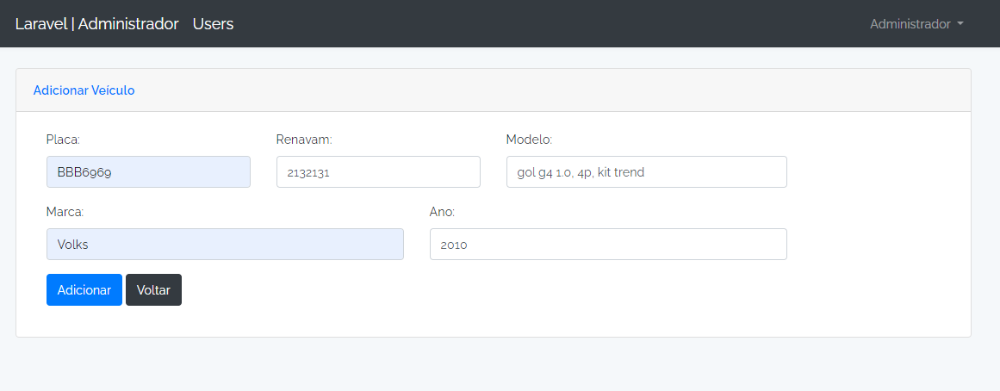

# Teste prático - Federal Soluções Técnicas

## Instalação 
* Execute composer install
* Renomeie o arquivo .env.example para .env
* Configure o acesso do seu banco de dados postgree no arquivo .env e email para utilização da notificação
* Execute php artisan key:generate
* Execute php artisan migrate
* Execute php artisan db:seed

## Demandas atendidas
* Acesso ao ambiente Administrativo
* Editar e excluir usuários
* Request validate (Regex placa do veículo e os caracteres do ano)
* Cadastrar, editar e excluir veículos
* Excluir veículos utilizando Soft Deleting
* Utilização do Notifications para envio de e-mail

## Demandas não atendidas
* Cadastro de novos usuários
* Utilização do Event do Laravel
* Ambiente de acesso do usuário

## Algumas telas
* Tela de Login

* Página Administrativa

* Listagem dos usuários cadastrados

* Tela de edição do usuário

* Cadastro de um novo veículo

* Tela de usuário listando os veículos vinculado.

